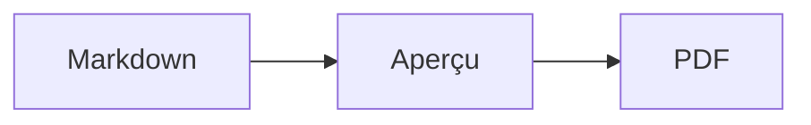

# Papier

Une SPA locale pour ouvrir, prévisualiser et imprimer des documents Markdown en PDF, avec prise en charge des diagrammes Mermaid.

## Démarrer

```bash
npm install
npm run dev
```

Ouvrez ensuite l’adresse indiquée par Vite. Pour produire un PDF, utilisez **Exporter en PDF**, puis choisissez **Enregistrer au format PDF** dans la boîte d’impression du navigateur.

## Diagrammes Mermaid

Utilisez un bloc de code `mermaid` standard :

````markdown

````

Le rendu est effectué localement et intégré au document sous forme de SVG imprimable. Une erreur de syntaxe Mermaid est affichée directement dans l’aperçu.

## Vérifications

```bash
npm run lint
npm run build
```
