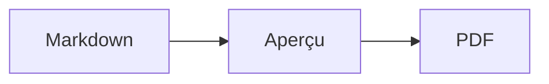

# Papier

Une SPA locale pour ouvrir, prévisualiser et imprimer des documents Markdown en PDF, avec prise en charge des diagrammes Mermaid.

Papier peut ouvrir un dossier complet, détecter tous ses fichiers `.md` et `.markdown`, puis permettre de choisir celui à afficher. Les images référencées avec un chemin relatif au document sont chargées depuis ce dossier sous forme d’URL locales temporaires : elles ne sont envoyées à aucun serveur.

## Démarrer

```bash
npm install
npm run dev
```

Ouvrez ensuite l’adresse indiquée par Vite. Pour produire un PDF, utilisez **Exporter en PDF**, puis choisissez **Enregistrer au format PDF** dans la boîte d’impression du navigateur.

## Documents et images locales

Utilisez **Ouvrir un dossier** pour conserver les relations entre les fichiers Markdown et leurs images :

```text
rapport/
├── introduction.md
├── annexes.md
└── images/
    └── architecture.png
```

Une référence comme `` est résolue relativement au fichier Markdown sélectionné. Le sélecteur affiché dans l’en-tête permet de passer d’un document du dossier à l’autre avant l’impression.

## Diagrammes Mermaid

Utilisez un bloc de code `mermaid` standard :

````markdown

````

Le rendu est effectué localement et intégré au document sous forme de SVG imprimable. Une erreur de syntaxe Mermaid est affichée directement dans l’aperçu.

## Vérifications

```bash
npm run lint
npm run build
```
