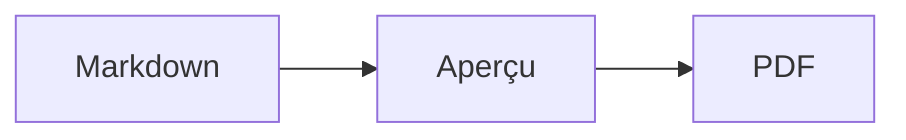

# Papier

Une SPA locale pour ouvrir, prévisualiser et imprimer des documents Markdown en PDF, avec prise en charge des diagrammes Mermaid.

Papier peut ouvrir un dossier complet, détecter tous ses fichiers `.md` et `.markdown`, puis permettre de choisir celui à afficher. Les images référencées avec un chemin relatif au document sont chargées depuis ce dossier sous forme d’URL locales temporaires : elles ne sont envoyées à aucun serveur.

## Démarrer

```bash
npm install
npm run dev
```

Ouvrez ensuite l’adresse indiquée par Vite. Pour produire un PDF, utilisez **Exporter en PDF**, puis choisissez **Enregistrer au format PDF** dans la boîte d’impression du navigateur.

## Documents et images locales

Utilisez **Ouvrir un dossier** pour conserver les relations entre les fichiers Markdown et leurs images :

```text
rapport/
├── introduction.md
├── annexes.md
└── images/
    └── architecture.png
```

Une référence comme `` est résolue relativement au fichier Markdown sélectionné. Le sélecteur affiché dans l’en-tête permet de passer d’un document du dossier à l’autre avant l’impression.

## Diagrammes Mermaid

Utilisez un bloc de code `mermaid` standard :

````markdown

````

Le rendu est effectué localement et intégré au document sous forme de SVG imprimable. Une erreur de syntaxe Mermaid est affichée directement dans l’aperçu.

## Vérifications

```bash
npm run lint
npm run build
```

## Sauvegarde et téléchargement

Le dossier importé, ses images, les modifications de tous ses documents, le document actif et les réglages sont sauvegardés dans IndexedDB. Ils sont restaurés au prochain chargement sur la même adresse et dans le même navigateur. L’indicateur de l’éditeur confirme la fin de l’enregistrement ou signale un échec. Les anciennes sauvegardes de texte sont reprises lors du premier démarrage.

**Télécharger .md** récupère le contenu actuel sous son nom de fichier. Les fichiers d’origine sur disque ne sont pas modifiés. Effacer les données du site efface aussi la sauvegarde du navigateur.

## Export PDF

L’export vérifie à nouveau les diagrammes et les images du document courant avant d’ouvrir l’impression. Une erreur empêche l’export et affiche un message ; une image qui ne charge pas sous 15 secondes est considérée en erreur. Le format A4/Letter et les marges sont transmis aux styles d’impression, avec des marges sur chaque page. Les réglages de la boîte d’impression du navigateur peuvent les remplacer.

### Contrôles fonctionnels

Avec le serveur de développement démarré et `playwright-cli` installé, lancer depuis la racine :

```bash
mkdir -p output/playwright
playwright-cli --session papier-check open http://127.0.0.1:5173
playwright-cli --session papier-check run-code "$(cat tests/browser-check.js)"
```

Ce scénario utilise des documents de test et contrôle la restauration du dossier et des images, le téléchargement, le blocage des exports invalides, le rendu Mermaid, le PDF multipage, la largeur mobile et les échecs de sauvegarde. Il remplace la session de documents du navigateur de test.

## Aperçu paginé

L’aperçu affiche des feuilles distinctes, numérotées, avec le même contenu paginé que l’impression. Les flèches et le sélecteur **Page** permettent de naviguer ; le compteur suit aussi le défilement. Un changement de format, de marges ou de thème recalcule les coupures. Le zoom change uniquement la taille à l’écran.

Le bouton **Insérer un saut de page** ajoute ce marqueur à la sélection dans l’éditeur :

```markdown
<!-- pagebreak -->
```

Placez-le seul entre deux blocs. Dans un bloc de code, le marqueur reste du texte. Les titres restent liés au contenu suivant, les tableaux répètent leurs en-têtes et les images/diagrammes sont limités à la hauteur utile d’une page. Pour retrouver les coupures de l’aperçu dans la boîte d’impression, conserver le format choisi et une échelle de 100 %, et désactiver les en-têtes/pieds de page ajoutés par le navigateur.

La pagination repose sur Paged.js, chargé à la demande. Ses calculs utilisent une zone de mesure indépendante pour fonctionner même quand l’aperçu mobile est masqué.

Le scénario complémentaire `tests/pagination-check.js` vérifie texte long, tableaux, Mermaid, sauts manuels, navigation et mobile, et produit les PDF de contrôle dans `output/playwright/` :

```bash
playwright-cli --session papier-check run-code "$(cat tests/pagination-check.js)"
```

## Édition et navigation dans un dossier

L’éditeur CodeMirror colore la syntaxe Markdown et conserve un historique d’annulation. La barre de mise en forme propose gras, italique, titre, lien, liste, citation et code. Les raccourcis sont **⌘/Ctrl+B** (gras), **⌘/Ctrl+I** (italique), **⌘/Ctrl+K** (lien), **⌘/Ctrl+Maj+H** (titre) et **⌘/Ctrl+F** (rechercher/remplacer). La recherche offre précédent/suivant, casse, mot entier, expressions régulières et remplacement individuel ou global. Un changement de document commence un nouvel historique d’annulation.

Le bouton dossier situé à côté du sélecteur ouvre l’arborescence. La recherche filtre les chemins sans tenir compte de la casse ni des accents. Le badge **Modifié** indique une différence avec le texte importé ; il persiste après rechargement et ne signifie pas un échec de sauvegarde. Les anciens dossiers déjà sauvegardés avant cette fonctionnalité prennent leur texte restauré comme référence initiale.

Les liens relatifs vers `.md` ou `.markdown` ouvrent le document correspondant du dossier, y compris `../`, les espaces encodés et une section `#titre-de-section`. Les ancres de titres sont en minuscules, sans accents, avec des tirets ; les doublons reçoivent `-1`, `-2`, etc. Un fichier absent est signalé sans quitter le document. Les liens web s’ouvrent dans un autre onglet.

## Fluidité

Pendant la frappe, l’aperçu conserve la page et la position à l’intérieur de celle-ci. Une nouvelle pagination remplace la précédente seulement lorsqu’elle est prête ; un calcul dépassé s’interrompt à une frontière de page. Les diagrammes Mermaid inchangés sont réutilisés dans un cache limité, avec des identifiants SVG distincts pour chaque occurrence.

Les sauvegardes regroupent les rafales de frappe (350 ms de pause, au plus 1,5 s d’attente avant lancement). IndexedDB conserve séparément les métadonnées, les documents et les images : seules les données modifiées sont réécrites. Les sauvegardes du format précédent migrent automatiquement. Attendre l’indicateur **Enregistré dans ce navigateur** avant de fermer la page garantit que la dernière transaction est terminée.

Contrôles complémentaires, depuis un serveur de développement :

```bash
playwright-cli --session papier-check run-code "$(cat tests/three-lots-check.js)"
playwright-cli --session papier-check run-code "$(cat tests/session-migration-check.js)"
```

Ils couvrent les raccourcis et le remplacement annulable, l’arborescence et les liens avec ancres, les badges persistants, la conservation de la page, le cache Mermaid, l’interruption d’un long calcul, les écritures incrémentales et la migration avec images.

### Typographie du document

Le panneau **Typographie**, sous les réglages de l’aperçu, propose huit familles :
Inter, Source Sans 3, Nunito Sans, Source Serif 4, Literata, Lora, JetBrains Mono et
Roboto Mono. Le texte et les titres ont des choix indépendants ; le code propose
les deux familles monospace. Les titres peuvent également suivre la police du texte.

Les préréglages **Rapport**, **Lecture** et **Documentation** combinent polices,
taille et interligne. La taille va de 9 à 18 points et l’interligne de 1,2 à 2.
Le bouton **Selon le thème** rétablit les réglages typographiques du thème actuel.
Changer de thème conserve les choix personnalisés. Les anciennes sessions gardent
leur typographie d’origine et les nouveaux réglages sont sauvegardés dans le navigateur.

Les polices variables, avec graisses et italiques, sont intégrées à l’application via
Fontsource (Latin et Latin étendu). Aucun service de polices externe n’est contacté
à l’ouverture d’un document. Les licences OFL sont distribuées dans
`public/licenses/fonts/`. Les caractères hors des alphabets inclus utilisent les
polices de secours du navigateur. La pagination et l’export attendent le chargement
des polices sélectionnées ; un échec de chargement bloque l’export.
